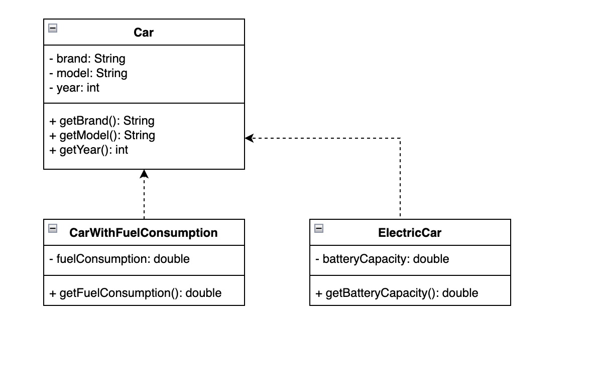

# UML диаграма
На диаграмме представлены три класса: Car, CarWithFuelConsumption и ElectricCar. Класс Car содержит приватные поля brand, model и year, а также публичные методы getBrand(), getModel() и getYear(), которые возвращают значения этих полей. Класс CarWithFuelConsumption расширяет класс Car и добавляет приватное поле fuelConsumption, а также публичный метод getFuelConsumption(), который возвращает значение этого поля. Класс ElectricCar также расширяет класс Car и добавляет приватное поле batteryCapacity, а также публичный метод getBatteryCapacity(), который возвращает значение этого поля.

